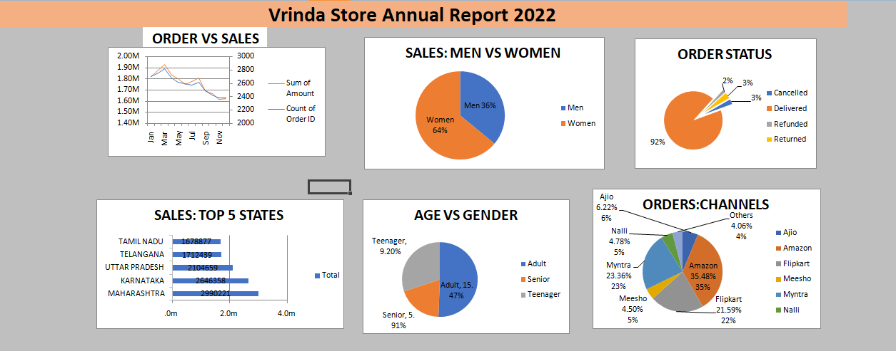

# Vrinda Store Sales Dashboard

## Project Overview

This project analyzes Vrinda Store sales data using Microsoft Excel. The dashboard provides insights into sales performance, customer demographics, order status, sales channels, and regional performance.

## Tools Used

* Microsoft Excel
* Pivot Tables
* Pivot Charts
* Slicers
* Data Cleaning

## Key Insights

* Women customers generated higher sales than male customers.
* Adult customers contributed the highest number of orders.
* Amazon, Flipkart, and Myntra were the leading sales channels.
* Maharashtra and Karnataka were among the top-performing states.
* Most orders were successfully delivered, indicating strong order fulfillment performance.

## Dashboard Preview

## Project Outcome

Created an interactive dashboard to monitor sales trends, customer behavior, and business performance, helping stakeholders make data-driven decisions.

## Author

Balram Kumar

Aspiring Data Analyst | Excel | SQL | Power BI | Python
